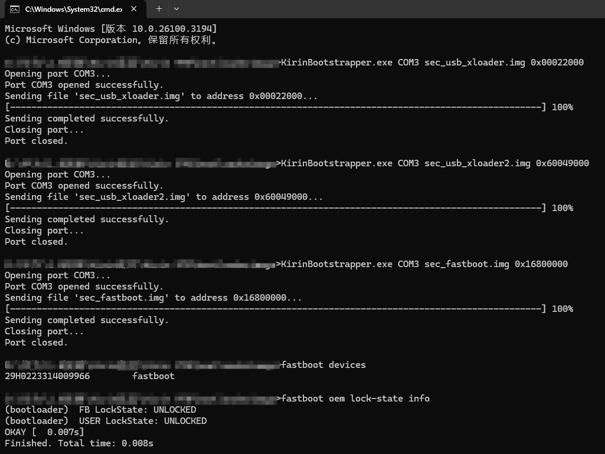
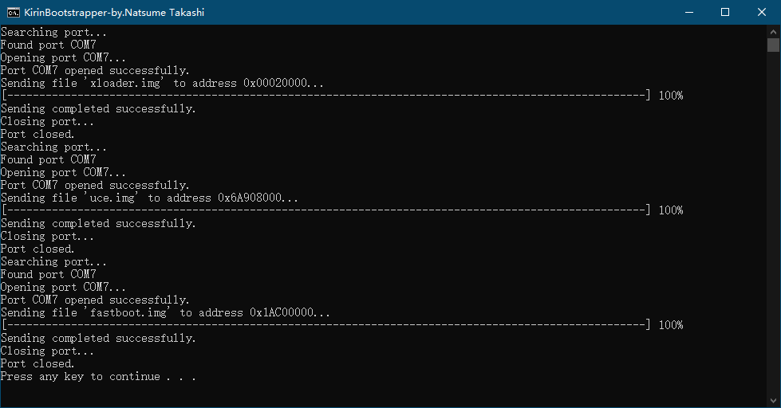

# KirinBootstrapper

A program is used to send images file to the USB Download Mode of the Kirin device

Based on project — [Potato.ImageFlasher](https://github.com/mashed-potatoes/Potato.ImageFlasher).

# Usage: 
KirinBootstrapper port file address sendTailFrame

port can be "auto"，The program will automatically look for ports

file，address and sendTailFrame is not necessarily required

If only the port parameter is provided, it enters the interactive mode and can continue to send images

# License

[GNU General Public License v3.0](LICENSE.txt)
